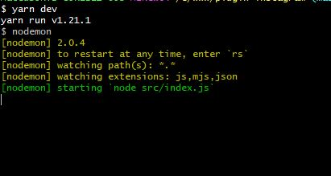
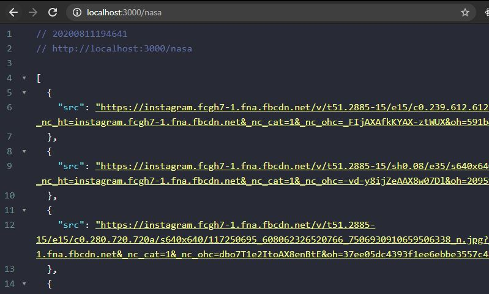

# Installing Plugin
## How to use

Well, this api have a simple endpoint for you improve a basic plugin of your website
You should use to any proposals; to list yours publishes or to show your images in a box in website.

## Requirements

You'll need the ```nodeJs``` to execute this app

## How to execute and test locally

After clone this project, you can execute this command in your favorite terminal ```npm i``` and ```npm dev```
You can see some like this image bellow:



And in your browser, type the address to your application and any username of instagram like that ```http://localhost:3000/nasa```


